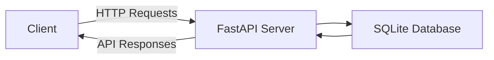

# Real-Time Cyber Threat Dashboard

## Overview
The Real-Time Cyber Threat Dashboard is an advanced application designed to provide cybersecurity professionals with a centralized platform for monitoring, analyzing, and reporting on cyber threats as they occur. This tool is essential for IT security teams, network administrators, and cybersecurity analysts who need to stay ahead of potential threats and manage alerts efficiently. Built with FastAPI, the dashboard offers a robust backend that serves dynamic content to the frontend, allowing users to interact with and visualize data effectively.

The application addresses the critical need for real-time threat detection and management in the cybersecurity domain. It provides live updates on current threats, facilitates alert management, and supports comprehensive threat reporting, making it an invaluable resource for strategic planning and decision-making.

## Features
- **Real-Time Dashboard**: Stay informed with live updates and analytics on current cyber threats.
- **Alert Management**: Create, view, and manage alerts related to detected threats for timely responses.
- **User Authentication**: Secure login system with roles and permissions to control access to different sections.
- **Threat Reporting**: Generate detailed reports on past threats and trends to aid in strategic planning.
- **Responsive Design**: Enjoy a seamless experience across different devices with a responsive user interface.
- **Static and Dynamic Content**: Combines static HTML templates with dynamic data rendering for an interactive experience.
- **Database Integration**: Utilizes SQLite for efficient data storage and management of threats, alerts, and user information.

## Tech Stack
| Technology   | Description                         |
|--------------|-------------------------------------|
| Python       | Programming language                |
| FastAPI      | Web framework for building APIs     |
| Uvicorn      | ASGI server for running FastAPI apps|
| SQLAlchemy   | ORM for database interactions       |
| Passlib      | Library for password hashing        |
| SQLite       | Database for storing application data|
| HTML/CSS/JS  | Frontend technologies               |

## Architecture
The application follows a client-server architecture where the backend, built with FastAPI, serves the frontend HTML templates and provides API endpoints for data interaction. The database models define the structure of the data stored in SQLite, and the data flow is managed through SQLAlchemy ORM.



## Getting Started

### Prerequisites
- Python 3.11+
- pip (Python package manager)

### Installation
1. Clone the repository:
   ```bash
   git clone https://github.com/yourusername/real-time-cyber-threat-dashboard-auto.git
   cd real-time-cyber-threat-dashboard-auto
   ```
2. Install the required packages:
   ```bash
   pip install -r requirements.txt
   ```

### Running the Application
1. Start the application using Uvicorn:
   ```bash
   uvicorn app:app --reload
   ```
2. Visit `http://127.0.0.1:8000` in your web browser to access the dashboard.

## API Endpoints
| Method | Path                | Description                        |
|--------|---------------------|------------------------------------|
| GET    | /                   | Render the main dashboard page     |
| GET    | /alerts             | Render the alerts page             |
| GET    | /reports            | Render the reports page            |
| GET    | /settings           | Render the settings page           |
| GET    | /login              | Render the login page              |
| GET    | /api/threats        | Retrieve all threats               |
| POST   | /api/alerts         | Create a new alert                 |
| GET    | /api/reports        | Retrieve a mock report             |
| POST   | /api/auth/login     | Authenticate user and return token |

## Project Structure
```
real-time-cyber-threat-dashboard-auto/
├── Dockerfile          # Infrastructure file for Docker setup
├── app.py              # Main application file with FastAPI setup
├── requirements.txt    # List of Python dependencies
├── start.sh            # Shell script for starting the application
├── static/             # Static files directory
│   ├── css/            # CSS files for styling
│   │   └── style.css   # Main stylesheet
│   └── js/             # JavaScript files
│       └── main.js     # Main JavaScript file for interactions
├── templates/          # HTML templates for rendering pages
│   ├── alerts.html     # Alerts page template
│   ├── dashboard.html  # Dashboard page template
│   ├── login.html      # Login page template
│   ├── reports.html    # Reports page template
│   └── settings.html   # Settings page template
```

## Screenshots
*Placeholder for screenshots illustrating the dashboard, alerts, and reports pages.*

## Docker Deployment
To deploy the application using Docker, follow these steps:
1. Build the Docker image:
   ```bash
   docker build -t cyber-threat-dashboard .
   ```
2. Run the Docker container:
   ```bash
   docker run -d -p 8000:8000 cyber-threat-dashboard
   ```

## Contributing
Contributions are welcome! Please fork the repository and submit a pull request with your changes. Ensure that your code adheres to the project's coding standards and includes appropriate tests.

## License
This project is licensed under the MIT License. See the LICENSE file for more details.

---
Built with Python and FastAPI.